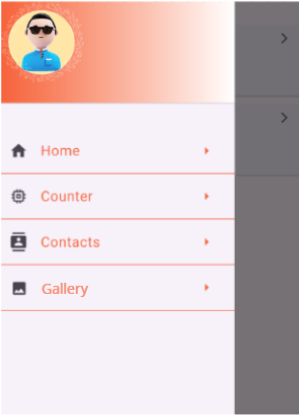
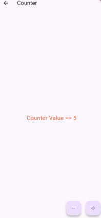
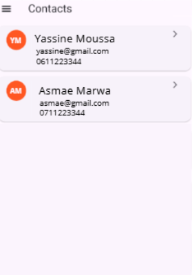

<h1>📱 Flutter App Navigation</h1>

Une application mobile développée avec <b>Flutter Framework</b>, offrant une interface simple et intuitive 
avec un menu de navigation latéral (Menu Drawer) permettant d’accéder 
aux différentes sections de l’application :
 
<b>1 - 🔢 Page Counter :</b> Une page classique avec un compteur incrémental
 
<b>2 - 📇 Page Contact :</b> Une page qui présente des informations de contact (nom, email, et téléphone)
 
<b>3 - 🖼️ Page Galerie :</b> Une page affichant une galerie d’images, en utilisant une grille (GridView).

 
<h3>📸 Captures d'écran</h3>
<table>
<thead>
<tr>
<th>Menu</th>
<th>Page Counter</th>
<th>Page Contact</th>
<th>Page Galerie</th>
</tr>
</thead>
<tbody>
<tr>
<th></th>
<th></th>
<th></th>
<th></th>
</tr>
</tbody>
</table>
 

 
<ul>
<li>🧑 <b>Réalisé par : </b>Iliasse Abdessamad</li>
<li>📖 <b>Sujet : </b>Développement Mobile via le Framework Flutter</li>
<li>📅 <b>Année : </b>2024 - 2025</li>
</ul>

